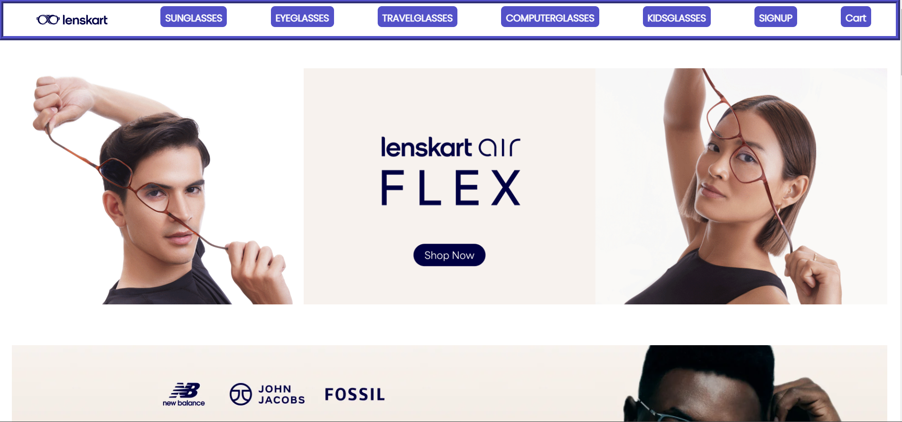
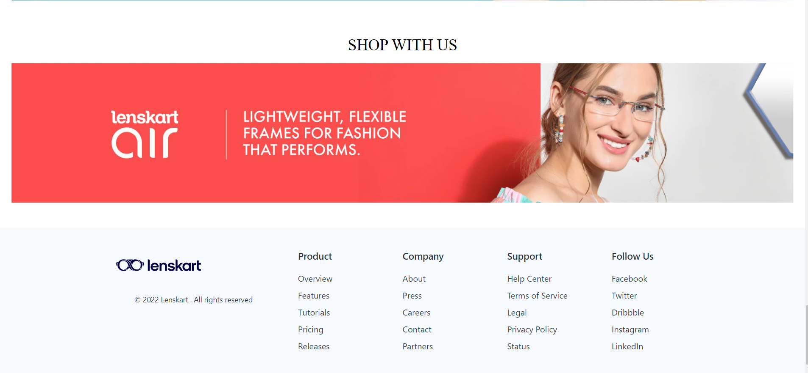
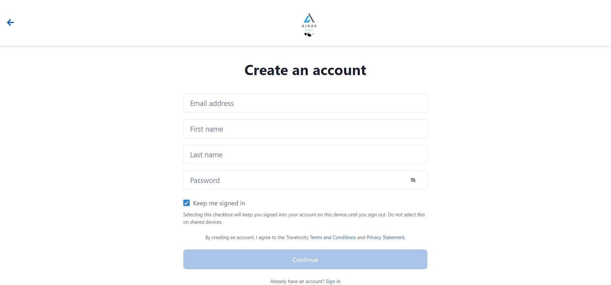
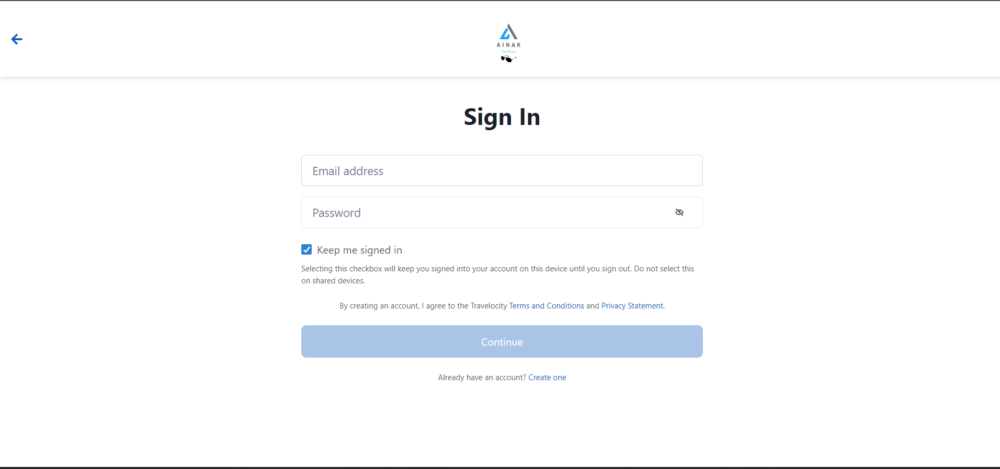
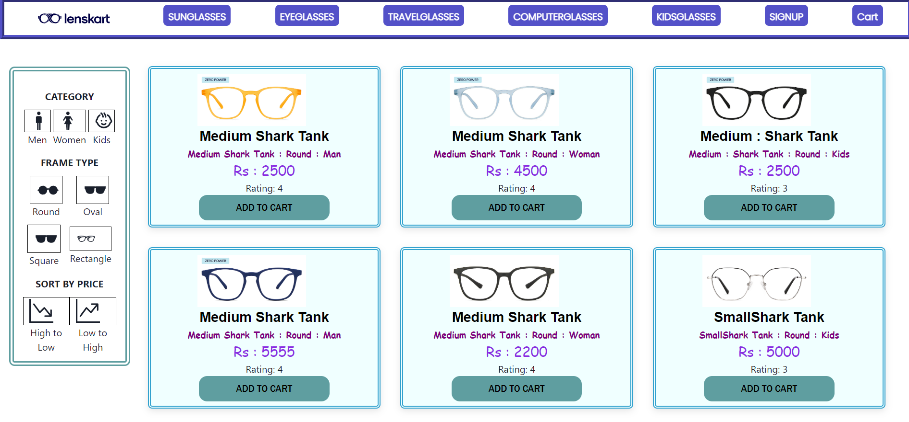
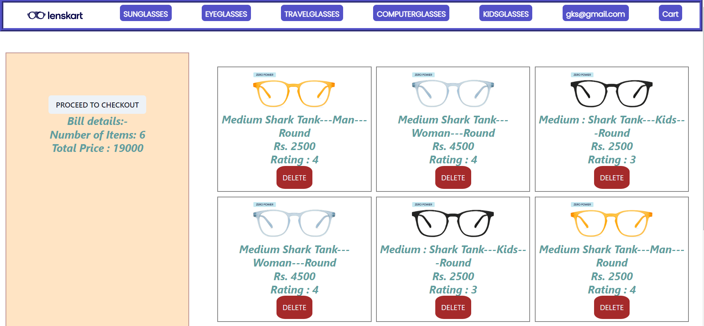
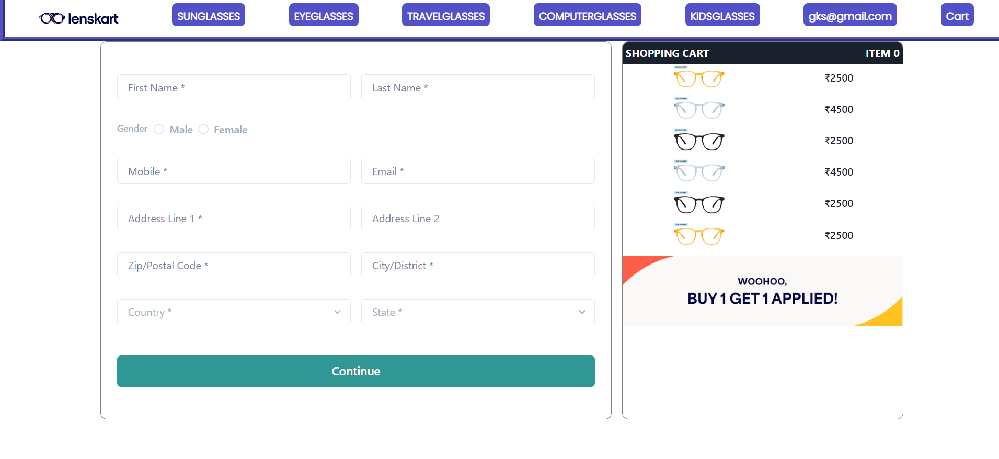
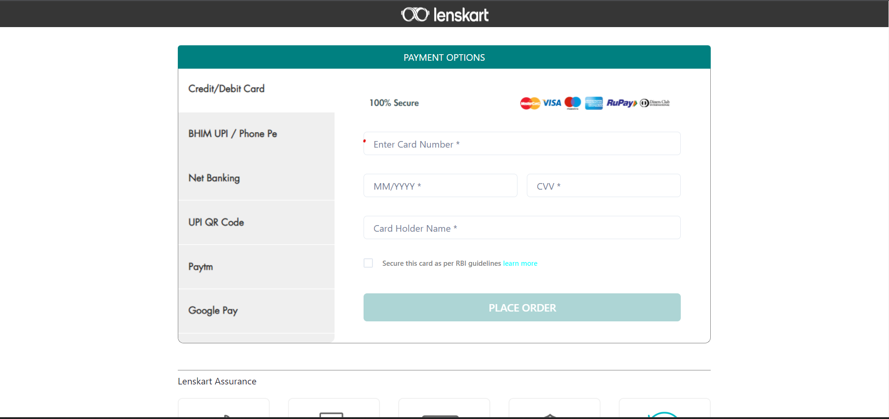

# Ainak 
# Ainak_website_photos

This is the photos of the Ainak website. Ainak is an online Ecommerce Website which is providing high quality eyewear. From this website, users can Order Computer Glasses,Sun Glasses,Kids Glasses and much more across the world.

**To see the live site click the below link.**

https://funny-pegasus-c3b55b.netlify.app/

## Built with
<ul>
  <li>React js</li>
  <li>Redux</li>
  <li>HTML</li>
  <li>CSS</li>
  <li>JavaScript</li>
</ul>

## Used libraries
<ul>
  <li>node modules</li>
  <li>Styled-Components</li>
  <li>axios</li>
  <li>React Js</li>
  <li>Redux</li>
  <li>React-router-dom</li>
  <li>Chakra-UI</li>
  <li>Chakra-UI-Icons</li>
  <li>React Icons</li>
</ul>

## Features
<ul>
  <li>Signup</li>
  <li>Login</li>
    <li>Sorting</li>
  <li>Individual Item Pages</li>
  <li>Filtering glasses by their Type and category including Men,Women and Kids</li>
</ul>

## Some screenshots of the project

### Thanks for reading
